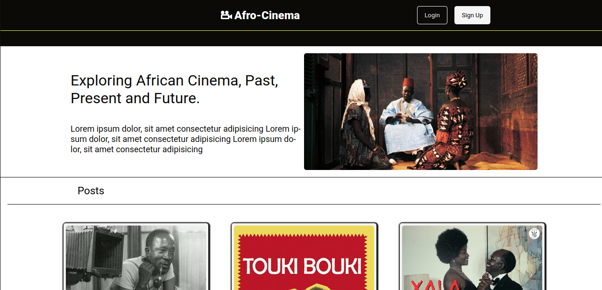

# PERN Afro Cinema Blog App | FRONTEND

Afro Cinema Blog app, to allow users to make blog posts.

### Afro Cinema Blog Author App | Frontend

[https://github.com/Lspacedev/afro-cinema-blog-author](https://github.com/Lspacedev/afro-cinema-blog-author)

### Afro Cinema Blog App | Backend

[https://github.com/Lspacedev/afro-cinema-blog-api](https://github.com/Lspacedev/afro-cinema-blog-api)

## Installation

1. Clone the repository

```bash
git@github.com:Lspacedev/afro-cinema-blog-client.git
```

2. Navigate to the project folder

```bash
cd afro-cinema-blog-client
```

3.  Install All Dependencies

```bash
npm install
```

4. Create an env file and add the following:

```bash
VITE_PROD_URL="Deployed backend url or localhost"
```

5. Run the project

```bash
npm run dev
```

## Screenshot




## Features

- View all blogs.
- View individual blog.
- Create an account.
- Login an account.
- Create a comment on blog post.

## Usage

1. Open the live site in your browser.
2. Login or create an account.
3. View blog posts and write comments.

## Tech Stack

- ReactJs
- NodeJs
- ExpressJs
- PostgreSQL
- Supabase storage

## Credits:

```python
Image by <a href="https://pixabay.com/users/wanderercreative-855399/?utm_source=link-attribution&utm_medium=referral&utm_campaign=image&utm_content=973460">Stephanie Edwards</a> from <a href="https://pixabay.com//?utm_source=link-attribution&utm_medium=referral&utm_campaign=image&utm_content=973460">Pixabay</a>

```
